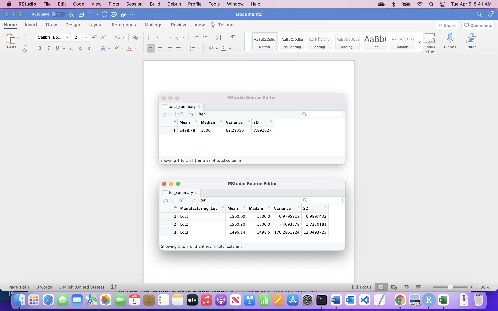

# MechaCar_Statistical_Analysis

## Summary Statistics on Suspension Coils
The design specifications for the MechaCar suspension coils dictate that the variance of the suspension coils must not exceed 100 pounds per square inch (PSI).

The ‘MechaCar_mpg.cvs’ dataset contains mpg test results for 50 prototype MechaCars. The MechaCar prototypes were produced using multiple design specifications to identify ideal vehicle performance. Multiple metrics, such as vehicle length, vehicle weight, spoiler angle, drivetrain, and ground clearance, were collected for each vehicle. 

The MecharCar ‘Suspension_Coil.csv’ dataset contains the results from multiple production lots. In this dataset, the weight capacities of multiple suspension coils were tested to determine if the manufacturing process is consistent across production lots.

‘total_summary’ contain the result of Mean, Median, Variance and SD.
‘lot_summary’ contain Manufacture_Lots (Lot1, Lot2, Lot3), Mean, Median, Variance and SD. 

People usually check the manufacture, mile per gallon (mpg), and the engine (horsepower) before buying car.

# What metric or metrics are you going to test?
Mile per gallon (mpg), Safty, horsepower test.

# What is the null hypothesis or alternative hypothesis?
H0 : There is no difference in frequency distribution between both groups.
Ha : There is a difference in frequency distribution between both groups.

# What statistical test would you use to test the hypothesis? And why?
T-Tests of mpg, safty and horsepower test for saftry.

# What data is needed to run the statistical test?
MechaCar_mpg and their competitor data.

